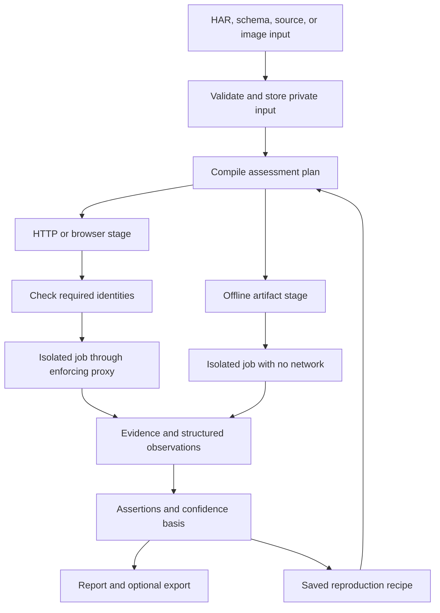
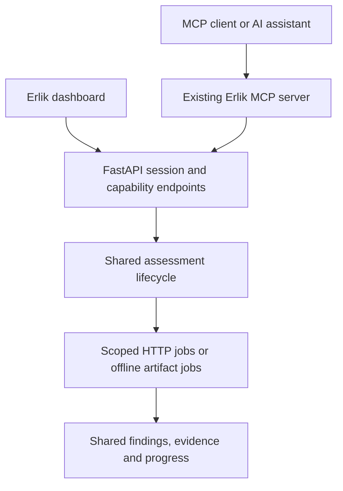

# Building Erlik's next pentesting capabilities

Prepared: 2026-09-12. Status: implementation guide; the new interfaces and files
described below are proposed, not implemented by this document.

> **Editor's note, added when this guide was committed (2026-09-12).** Three
> things in the text below did not match this repository and were reconciled
> rather than left to rot, because a document that names paths a reader will rely
> on is worse than useless once they do not resolve — the standard
> `tests/test_security_doc.py` already applies to `SECURITY.md`, and
> `tests/test_next_capabilities_doc.py` now applies it here.
>
> 1. The "future development plan" link pointed at `erlik-future-development-plan.md`;
>    this repository's copy is [future-plan.md](future-plan.md), and the link now
>    points there.
> 2. `code-review-2026-09-12.md` and `.specify/memory/constitution.md` do not
>    exist in this repository. Their sentences are kept verbatim but are no longer
>    links, so nothing promises a file that is not here. If those documents live
>    elsewhere, link them when they land.
> 3. **Section 4's six "phase zero" items are all already done.** They are
>    `E-001` through `E-006` in [future-plan.md](future-plan.md) and every one is
>    marked CLOSED there. Two later increments strengthened three of them beyond
>    what section 4 asks: commit `93cef85` made a finalization failure degrade the
>    assessment instead of recording `completed` over a `running` stage, corrected
>    the benchmark's evidence validation, and wired `ci_assert_suite_ran.py` to all
>    four junit reports CI writes; commit `34e7ca8` stopped a half run reporting
>    absence as a clean result. Section 4 is therefore a record of how the baseline
>    was reached, not outstanding work — and its "161 passing network-free tests"
>    figure is stale: the suite is 3373 passing in a developer tree and 3338 on a
>    fresh clone, measured 2026-09-17. Read section 4 as history; start at
>    section 5.

MCP delivery update: extend the existing Erlik MCP server with the tool catalogue
in [section 18](#18-extending-the-existing-mcp-server). Expose existing adapters
first. Source copying remains an optional implementation technique when an
adapter needs upstream modifications; it is not required to expose a scanner
through MCP.

The recommended next release combines multi-identity authorization tests,
recorded requests, reproducible workflows, and remediation retests. Add Gitleaks,
Semgrep CE, and Trivy for engagements that supply source or deployment artifacts.
Reuse upstream code through tracked source snapshots and small, attributed ports.

This guide builds on the [future development plan](future-plan.md)
and the current correctness review (`code-review-2026-09-12.md`, not in this
repository). It describes how to build the features in this repository, including
where copying upstream source helps and where it creates unnecessary maintenance
or licensing problems.

## 1. Build decisions

| Capability | Reuse decision | First useful delivery |
|---|---|---|
| Authorization matrix | Adapt selected MIT AuthMatrix logic into native Python; use Autorize only as a behavioral reference until its code license is verified | Two identities, one object, expected permissions, paired response evidence |
| Capture and replay | Extend the existing mitmproxy addon and Playwright worker | Import a HAR, select a request, bind a fresh identity, replay through policy |
| Business logic | Build an Erlik workflow/assertion engine using existing fixture concepts | A selected operation sequence with setup, assertions, and cleanup evidence |
| Remediation retest | Build on existing fingerprints, evidence, and triage | Re-run one finding's reproduction with positive controls |
| Gitleaks | Keep a pinned copy of upstream Go source; compile a standalone worker executable | Scan a supplied directory with redacted JSON output |
| Semgrep CE | Prefer result ingestion, then a separate source-built CE executable | Import JSON/SARIF; subsequently scan using Erlik-owned or separately permitted rules |
| Trivy | Keep a pinned upstream Go source snapshot; build a standalone executable | Scan an uploaded image archive against a recorded vulnerability database |

Copying code is a valid implementation choice when its license permits it.
Retain original authorship and make local modifications traceable. Keep large
upstream engines in their original language and build system; Erlik's Python
adapters should provide configuration, execution, and result normalization.

## 2. Source reuse and licenses

Erlik's root [LICENSE](../LICENSE) is MIT. It does not replace the licenses of
copied third-party files. The existing
[THIRD_PARTY_LICENSES.md](../THIRD_PARTY_LICENSES.md) and `licenses/` directory
already establish an attribution pattern for communitytools-derived code.

The following are source-license observations checked on the date above, not a
blanket determination for every dependency, rule, image, or distribution model.
Check the exact selected revision before importing it.

| Project | Verified upstream position | Plan for Erlik |
|---|---|---|
| AuthMatrix | MIT license and copyright notice in its source | Copy selected portions with the notice; document changes and original file locations. [License](https://raw.githubusercontent.com/SecurityInnovation/AuthMatrix/master/LICENSE) |
| Autorize | The reviewed PortSwigger repository describes a Jython/Burp extension; a reusable code license was not located in the reviewed root files | Do not vendor its implementation yet. Use AuthMatrix or an original implementation; identify an applicable license or obtain permission before copying Autorize. [Repository](https://github.com/PortSwigger/autorize) |
| Gitleaks | MIT | Source vendoring and modification are suitable with retained notices. Review bundled dependencies too. [License](https://raw.githubusercontent.com/gitleaks/gitleaks/master/LICENSE) |
| mitmproxy | MIT | Extend through the addon API; retain attribution for copied helpers. [License](https://raw.githubusercontent.com/mitmproxy/mitmproxy/main/LICENSE) |
| Trivy | Apache-2.0 | Preserve license and applicable attribution/NOTICE material; mark modified files and review bundled dependencies. [License](https://raw.githubusercontent.com/aquasecurity/trivy/main/LICENSE) |
| Semgrep engine | Root license is LGPL-2.1 | Keep a distinct component. Track modifications and the corresponding source/build materials needed for the chosen distribution. Do not relabel copied engine code as MIT. [License](https://raw.githubusercontent.com/semgrep/semgrep/develop/LICENSE) |
| Semgrep rules repository | Separate Semgrep Rules License v1.0 | Do not vendor the collection as a freely redistributable rule pack. Use original Erlik rules or rules with individually verified compatible grants. [Rules license file](https://raw.githubusercontent.com/semgrep/semgrep-rules/develop/LICENSE) |

The Semgrep Rules License limits use to internal business purposes and does not
grant redistribution or service availability rights. This matters directly to
shipping Erlik or operating it for clients. Running the engine in a container
does not remove rule-license restrictions. Do not enable automatic registry
downloads as the default solution. [Actual license terms](https://semgrep.dev/legal/rules-license/)

For LGPL components, packaging as a separate executable is an engineering
boundary, not an exemption from obligations when distributing that executable.
Record the source and notices supplied with a release. Resolve the exact
distribution terms before shipping copied LGPL source or binaries.

### Repeatable source import procedure

1. Select a release and resolve it to a full commit SHA. Do not track a moving
   branch as the deployed version. Record release/tag, SHA, and archive checksum.
2. Inspect the license of the selected files, dependencies, rules, and data.
   Preserve upstream notices rather than replacing the header with Erlik's name.
3. Fetch the source into a disposable build environment. Source acquisition is
   a build operation, separate from an assessment against a target.
4. Keep an unmodified snapshot under `third_party/<project>/upstream/`, or keep
   a reproducible archive in a controlled source store. For this project's
   preference, commit source snapshots for Gitleaks/Trivy after evaluating size.
5. Keep upstream engines intact and put Erlik-specific patches in
   `third_party/<project>/patches/`. Apply patches to a build copy; leave the
   snapshot unchanged. For a small Python port, keep the adapted implementation
   under `orchestrator/integrations/vendor/` with a source mapping.
6. Add the original license to `licenses/`, update `THIRD_PARTY_LICENSES.md`, and
   list every derived local file. Keep an adjacent modification history.
7. Build in a pinned toolchain image. Lock dependencies, capture compiler/tool
   versions, retain an SBOM, and record the resulting image digest.
8. Run upstream tests relevant to copied behavior plus Erlik compatibility and
   isolation tests. Passing upstream tests alone does not validate Erlik policy.
9. Review the diff, attribution, generated image contents, and release package.
   Include corresponding source where required. No upstream contribution or
   external message is necessary to create a local, compliant source copy.

Proposed layout; these directories are not created by this guide:

```text
third_party/
  manifest.json
  authmatrix/{upstream/, patches/, PORTING.md}
  gitleaks/{upstream/, patches/, BUILD.md}
  trivy/{upstream/, patches/, BUILD.md}
  semgrep/{upstream/, patches/, BUILD.md}   # if source building is adopted
licenses/
  authmatrix-MIT.txt
  gitleaks-MIT.txt
  trivy-Apache-2.0.txt
  semgrep-LGPL-2.1.txt
docker/integrations/
  Dockerfile.gitleaks
  Dockerfile.semgrep
  Dockerfile.trivy
```

Manifest design example, intentionally unresolved until an import is tested:

```json
{
  "schema_version": 1,
  "components": [{
    "name": "gitleaks",
    "repository": "https://github.com/gitleaks/gitleaks",
    "upstream_commit": "REPLACE_WITH_VERIFIED_FULL_SHA",
    "source_sha256": "REPLACE_WITH_ARCHIVE_HASH",
    "license": "MIT",
    "license_file": "licenses/gitleaks-MIT.txt",
    "reuse_mode": "source-built-executable",
    "patches": [],
    "build_image_digest": null,
    "runtime_image_digest": null,
    "tested_output_version": null,
    "update_owner": "Erlik maintainer"
  }]
}
```

The future build checker must reject placeholder SHAs, missing licenses,
unrecorded patches, and unresolved runtime digests in a release manifest. No
unverified scanner version is being designated as tested in this guide.

### Example: bring a pinned Gitleaks snapshot into the repository

The following is a manual source-import recipe, not an installer and not a scan.
Run from the Erlik repository only after selecting and reviewing a full upstream
commit. It deliberately refuses the placeholder and an existing vendor directory.
Dependencies and compiled binaries still require the build step described below.

```sh
(
set -eu
erlik_upstream_commit='REPLACE_WITH_VERIFIED_FULL_SHA'
test "${#erlik_upstream_commit}" -eq 40 || exit 1
case "$erlik_upstream_commit" in *[!0-9a-f]*) exit 1 ;; esac
test ! -e third_party/gitleaks || exit 1
erlik_source_tmp=$(mktemp -d /tmp/erlik-source.XXXXXX)
git clone --no-checkout https://github.com/gitleaks/gitleaks.git "$erlik_source_tmp/repo"
git -C "$erlik_source_tmp/repo" archive --format=tar --output="$erlik_source_tmp/source.tar" "$erlik_upstream_commit"
shasum -a 256 "$erlik_source_tmp/source.tar"
mkdir -p third_party/gitleaks/upstream
tar -xf "$erlik_source_tmp/source.tar" -C third_party/gitleaks/upstream
cp third_party/gitleaks/upstream/LICENSE licenses/gitleaks-MIT.txt
)
```

The subshell stops on failure without exiting the surrounding terminal.
Record the printed checksum and selected commit in
the manifest. This recipe is for a reviewed upstream Git archive, not for uploaded
client archives, which require the hardened extraction path in section 9.

For Go engines, use a multi-stage Docker build: a compiler stage containing the
vendored source and locked modules, then a small runtime containing only the
executable, runtime assets, and notices. Start with the chosen upstream build
recipe; preserve any generation/version flags it requires. Suggested build
targets to verify against that revision are Gitleaks's root package and Trivy's
`./cmd/trivy`. Download dependencies only in the controlled build stage; build
from the prepared module cache without network where possible. Add the new image
to availability, the capability registry, and an optional Compose build profile.

Do not run `go build`, Semgrep's build tooling, or repository install scripts on
client-supplied source as part of an assessment. These instructions compile the
reviewed scanner source only.

## 3. Existing code to extend

Paths below exist in the reviewed working tree. Proposed additions later in the
guide do not exist yet. Some existing integration files remain uncommitted;
establish a reviewed baseline without discarding unrelated local work.

| Existing file | Reuse | Required extension |
|---|---|---|
| [contracts.py](../orchestrator/integrations/contracts.py) | `AssessmentConfig`, `Identity`, `RequestSpec`, `StageResult`, `IntegrationFinding` | Typed capability configurations, request templates, artifact subjects, versioned fingerprints |
| [adapters.py](../orchestrator/integrations/adapters.py) | `Adapter`, `BaseAdapter`, `Context`, `rpc`, `record`, `ADAPTERS` | Register native checks; keep new scanner parsers in separate modules |
| [service.py](../orchestrator/integrations/service.py) | Preflight, registration, authentication, run lifecycle | Capability dependencies, assessment-wide stages, paired-identity stages, repair terminal states |
| [runtime.py](../orchestrator/integrations/runtime.py) | `Sandbox`, job manifests, cancellation, orphan recovery | A strict offline artifact execution mode sharing job ownership |
| [worker.py](../orchestrator/integrations/worker.py) | HTTP RPC and browser/workflow actions | Richer request bodies, isolated journey execution, bounded cleanup |
| [proxy_addon.py](../orchestrator/integrations/proxy_addon.py) and [egress_policy.py](../orchestrator/integrations/egress_policy.py) | HTTP enforcement, identity attachment, budgets | Structured capture hooks and policy-authorized replay |
| [security.py](../orchestrator/integrations/security.py) | Secret store, private writes, redaction | Artifact/body redaction, sensitive-field metadata, profile revision tracking |
| [inventory.py](../orchestrator/integrations/inventory.py) | Endpoint handoff | Operation/template references and coverage by identity |
| [persistence.py](../orchestrator/integrations/persistence.py) | Additive SQLite migrations and evidence storage | Templates, matrices, attempts, artifacts, workflow journals, retests |
| [api.py](../orchestrator/integrations/api.py) and [main.py](../orchestrator/main.py) | Protected integration endpoints and session lifecycle | Explicit imports, validated launch actions, cancellation and evidence views |
| [integrations.html](../dashboard/templates/integrations.html) | Assessment dashboard | Matrix editor, request editor, source inputs, retest results |
| [defectdojo.py](../orchestrator/integrations/defectdojo.py) | Stable synchronization and explicit export | Export new finding subjects without inventing HTTP URLs |

Two important current constraints:

- `AssessmentConfig.stages` is a closed literal list. Adding an adapter class
  alone will not make it selectable, preflighted, scheduled, or visible in the UI.
- `service.register()` currently expands stages per selected identity. Source
  scans should execute once per artifact, and authorization matrices once per
  selected identity set. Do not multiply either by every identity accidentally.

`RequestSpec` currently models a JSON object body, and the worker reads text
responses into memory. It is not a complete HAR/repeater request model. Add
bounded binary/form support before promising faithful request replay.

## 4. Phase zero: repair the execution baseline

> Already done. These six items are `E-001` through `E-006` in
> [future-plan.md](future-plan.md) and all six are marked CLOSED there; see the
> editor's note at the top of this file for the two later commits that went
> further. Kept for the record of what the baseline required.

Implement the six items in the correctness review before adding live
probe paths:

1. Register callback collector ownership before cancellable probe execution.
2. Keep selected mutating catalogue probes inside their fixture/cleanup boundary.
3. Restore callback observation dependencies when an assessment resumes after
   credential replacement; preserve probe identity and avoid automatic replay.
4. Persist accurate assessment and stage terminal states when finalization fails.
5. Correct benchmark evidence validation: references must exist, and required
   proof must be present; a legitimate empty diagnostic file is not lost proof.
6. Run lifecycle, benchmark, and configured real-service acceptance in CI, with
   explicit opt-in suites and visible skip reporting.

The earlier review recorded 161 passing network-free tests and four additional
regression reproductions that failed the expected-correctness assertions. Those
results describe that review, not a fresh test run for this document.

Changes affecting execution or scope require tests and human review under the
project constitution (`.specify/memory/constitution.md`, not in this repository).
Build and test the change, then leave the concrete diff for review; do not
self-merge it.

## 5. Shared design for the new features



### Contracts and scheduling

Add a capability registry with execution kind, dependency IDs, required inputs,
identity cardinality, mutation classification, and availability requirements.
Use it to compile a deterministic sequential plan. Keep a versioned effective
configuration in each assessment, including every override.

Capability execution kinds should initially be `http`, `browser`, `offline`,
and `import`. Importing a result must not launch a scanner or fetch an embedded
URL. Artifact stages should not require a dummy HTTP target: introduce a typed
assessment subject or a linked artifact assessment, retaining old HTTP session
inputs unchanged. Keep legacy reports readable.

Retain default budgets of five target requests/second, two concurrent requests,
600 seconds/stage, and 1,800 seconds/assessment. Controls, fixtures, redirects,
browser resources, and cleanup consume the assessment budget. Reserve a bounded
cleanup interval before a mutating workflow starts. Artifact jobs need independent
CPU/memory/disk limits and a time allocation within the same assessment deadline.

Suggested initial input limits: HAR 25 MiB, 5,000 entries, retained body 1 MiB per
message; source archive 250 MiB compressed/1 GiB expanded/50,000 files; image
archive 2 GiB with a 10 GiB extraction quota. These are proposed configurable
defaults, to be measured against fixtures. Reject or explicitly record partial
ingestion when a limit is hit. Streaming parsers must enforce limits while reading.

### Data model additions

Use explicit column lists and additive migrations with indexes; do not rely on
existing positional `INSERT ... VALUES` patterns when adding columns.

| Proposed table | Important fields and invariants |
|---|---|
| `integration_request_templates` | ID, project/session, version, method, origin, route, query/header lists, private body ref, source evidence, identity binding, mutation flag |
| `integration_authz_cases` | ID/version, template ID, owner/control identity, tested identity IDs, object/tenant context, expected permission, assertion definition |
| `integration_attempts` | ID, stage, case version, identity/profile revision, request/response evidence, assertion result, timing, execution status |
| `integration_artifacts` | ID, project, kind, digest, private storage ref, size, immutable snapshot metadata, declared deployment association |
| `integration_workflow_runs` | ID, definition version, current step, scoped variable refs, setup/cleanup journal, terminal outcome |
| `integration_retest_runs` | ID, original finding, recipe version, new assessment, controls, comparison outcome, evidence refs |
| `integration_coverage` | Assessment, operation, identity, applicable check, attempted/verified/excluded/incomplete status and reason |

Store independent observations as typed records or in a dedicated observations
table rather than relying only on an opaque stage-result JSON blob. Keep bounded
unrecognized scanner fields under a namespaced metadata field.

HTTP finding fingerprints already exist. Add a versioned identity scheme for
authorization cases and non-HTTP findings rather than passing source paths to
`canonical_origin()`. Use stable project/subject IDs plus rule and location;
record commit/image digest as occurrence metadata. Source matching across code
changes should use a documented location/context strategy, with uncertain matches
requiring triage. Do not claim line numbers alone are stable across refactors.

For authorization, include the operation, parameter, owner/tested identity
relationship, tenant boundary, and assertion ID. Store concrete object IDs in
private reproduction data. Maintain old fingerprints and remote mappings; provide
explicit aliases if migrating an existing finding to a newer scheme.

### Evidence and credentials

Keep exact executable request bodies and credentials in permission-restricted
runtime storage, referred to by opaque IDs. Store redacted request/response
evidence for reports and model input. Give raw sensitive captures a separate
explicit retention/access policy; never treat redaction as reversible.

Preserve duplicate HTTP headers and binary body encoding in the new template
format. Recompute transport headers when sending. Remove captured credentials,
then apply only the selected profile at the permitted origin. Track profile
revisions so replacement credentials do not silently alter historical evidence.

Run deterministic content assertions before redacting; persist assertion ID,
result, and redacted supporting evidence. Never persist an unredacted secret
just because it is needed for a comparison. Template imports do not create new
identity profiles automatically.

## 6. Authorization matrix: port AuthMatrix selectively

AuthMatrix is a Burp extension. Its main implementation includes the original
MIT notice and Burp/Java integration. A wholesale Python import into FastAPI is
not a practical reuse path. [Upstream source](https://raw.githubusercontent.com/SecurityInnovation/AuthMatrix/master/AuthMatrix.py)

### Porting boundary

Inspect the pinned source and extract the smallest reusable parts for
user/role/request relationships and result comparison. Write `PORTING.md` mapping
each adapted function to its original source location. Keep any source-derived
tests attributed too. Replace Java collections and Burp message objects with
Erlik models; replace upstream networking with the existing sandbox worker.
Leave UI, Burp callbacks, thread pools, and persistent Java state outside the port.
If the chosen revision has no separable logic, implement the model directly and
record that no source was copied; do not import a large unused file for attribution.

Proposed modules:

```text
orchestrator/integrations/vendor/authmatrix_core.py  # only actual adapted code
orchestrator/integrations/authz.py                  # Erlik adapter and execution
orchestrator/integrations/assertions.py             # pure assertion evaluation
tests/test_authz_matrix.py
tests/fixtures/authorization_target.py
```

### Execution algorithm

1. Resolve each case to a concrete request and declared object owner. Verify
   the operator selected active authorization testing, even for GET replays.
2. Verify all required profiles using the existing authentication assertions.
   Use a separate sandbox/browser context for each identity, including anonymous.
3. Execute the owner's request as a positive control. Require that the intended
   object and a case-specific marker are actually returned.
4. Execute the same object request under the other selected identities. Include
   controls against each identity's own object where applicable.
5. Evaluate expected permissions using response content or typed JSON selectors.
   A login page returning 200, equal response length, or similar HTML is not proof.
6. Recheck authentication, preserve paired evidence, and classify the result.
   Expiry yields `needs_auth`; missing controls yield an inconclusive observation.
7. Present expected versus observed access. Confirm a violation only when the
   response demonstrates the forbidden object/action under the tested identity.

Proposed example; this is not accepted by today's API:

```yaml
schema_version: 1
authorization:
  enabled: true
  cases:
    - id: invoice-owner-boundary
      template_id: template-invoice-read
      owner_identity_id: identity-alice
      tested_identity_ids: [identity-bob, anonymous]
      resource_bindings:
        invoice_id: fixture-alice-invoice
      expected_access: deny
      assertion:
        type: forbidden_json_value
        pointer: /owner_id
        expected_private_ref: fixture-alice-owner-id
```

The pointer assertion must distinguish absent fields, malformed JSON, redacted
responses, and genuine denial. Do not infer ownership from user-controlled text
that merely echoes a submitted value. Fixture truth is the control.

Acceptance: seeded vulnerable and fixed versions; same-role users in one tenant;
users in separate tenants; administrator-only operation; anonymous response;
misleading 200 login page; profile expiry; no cookie crossover; blocked redirect;
all required evidence associated with exactly the tested case.

## 7. Capture, HAR import, and replay

Erlik already launches mitmproxy in `Dockerfile.proxy` and loads `proxy_addon.py`.
Add capture hooks next to the scope guard and use its policy decision; do not
create a second unrestricted proxy. Mitmproxy's addon API provides request and
response event hooks suitable for this extension. [Addon reference](https://docs.mitmproxy.org/stable/addons/overview/)

### Build sequence

1. Add `capture.py` for HAR normalization and `request_templates.py` for typed
   templates. Import is network-free and records provenance per entry.
2. Preserve the original private capture, normalize only the executable form,
   and classify excluded/service-only URLs separately from assessment endpoints.
   Imported hosts never extend the scan allow-list.
3. Remove authentication and transport headers from reusable templates; replace
   sensitive fields with typed secret/fixture references. Avoid string substitution
   across an entire raw HTTP message.
4. Implement a richer worker request action: ordered headers/query values,
   JSON/form/raw body variants, response-size limits, redirect history, and
   explicit unsupported cases. Reject malformed or ambiguous message framing.
5. Add a replay preview: method, URL, identity, changed fields, mutation status,
   and expected assertion. Revalidate policy at execution, not only preview time.
6. Add a response comparison view that can ignore operator-declared volatile
   fields. Preserve full evidence; normalization must not hide ownership fields.
7. Add saved browser journeys using a typed action list, bounded waits, and
   isolated storage state. Do not execute arbitrary uploaded Python or JavaScript.

Playwright can record HAR data on browser contexts. Close the context gracefully
to flush artifacts, then close the browser. This is distinct from HAR routing,
which can serve recorded responses instead of testing the live server.
[Playwright browser contexts](https://playwright.dev/python/docs/api/class-browser#browser-new-context)

A headed operator login helper does not by itself provide isolated capture of a
complete assessment. Keep login/service traffic separate; require the new journey
executor to enforce assessment scope, resource budgets, and mutation selections.
Continue rejecting unsupported WebSocket execution until message-level policy
and tests exist. Browser clicks can trigger mutations; classify by resulting
requests and selected operations, not by the apparent harmlessness of the click.

Acceptance: JSON/form/binary fixtures, duplicate headers, signed request marked
unsupported when it cannot be regenerated, expired CSRF value, oversized body,
external redirect, credential replacement, script-containing report fields, and
HAR import that makes zero network requests.

## 8. Business logic and workflow verification

Extend the existing `Workflow` and worker fixture concepts with a typed sequence
engine in `workflows.py`. Do not accept shell commands as workflow steps.

Each definition needs exact selected operations, identity bindings, setup,
bounded extraction into private variables, test steps, invariant assertions,
cleanup, and a maximum request/time budget. Build HTTP steps first; reuse saved
browser journeys only when the same policy covers their requests.

Initial lab scenarios: a single-use coupon rejected on second use; an approval
step required before an action; an object remaining inaccessible after transfer
to another tenant. Start with known fixture IDs and documented expected behavior.
Unexpected status codes alone remain observations.

Persist a workflow journal before every mutating request. Record resource IDs
as soon as setup creates them. Cleanup runs in a bounded cancellation-shielded
section while the worker still exists; the orchestrator owns a fallback cleanup
attempt if the worker dies. If authentication or policy prevents cleanup, retain
an explicit unresolved-resource record and manual cleanup guidance.

After an orchestrator crash, mark the workflow interrupted. Do not replay either
mutations or cleanup automatically: surface recorded resources and offer a
separately selected recovery action. Killing a container is not proof that a
server-side mutation did not happen.

Acceptance: setup fails halfway, assertion fails, scan times out, cleanup fails,
credential expires, operator cancels, orchestrator dies after mutation, and an
unselected operation receives zero requests. Tests must observe target state.

## 9. Artifact execution foundation

Source/image analysis differs from scanning HTTP targets. Add a typed offline
mode to shared job ownership rather than running tools on the FastAPI host.
Do not loosen the existing HTTP sandbox or use registry credentials as permission
to scan the registry.

Required offline worker properties:

- Docker `--network=none`; no proxy fallback, host networking, host PID namespace,
  privileged mode, or Docker socket mount.
- Read-only source/image inputs, dedicated output, bounded writable cache/tmp,
  non-root runtime where supported, dropped capabilities, CPU/memory/PID/disk
  limits, and cancellation/recovery manifests shared with HTTP jobs.
- Archive extraction rejects path traversal, absolute paths, escaping symlinks,
  device nodes, and decompression bombs. Resolve artifact IDs server-side; never
  accept an arbitrary server filesystem path from the dashboard.
- Do not execute repository build scripts, package installation hooks, or fetched
  Git submodules merely to scan supplied source. Scan a snapshot or supplied Git
  history without checking out/running untrusted code.
- Download dependency databases during an explicit maintenance/build operation.
  Record source, license, digest, timestamp, and expiry policy for each bundle.

Implement Gitleaks first because it provides a compact end-to-end artifact
execution path. Add Semgrep and Trivy once that path passes lifecycle tests.

## 10. Gitleaks from copied source

Keep its Go source and dependency lockfiles intact; compile its CLI into an
Erlik scanner image. Use the chosen revision's upstream build recipe and record
the tool version even when custom compilation does not embed release metadata.
Source copy does not imply rewriting its detector as Python.

Add `gitleaks.py` with a pure JSON parser and adapter. Add directory mode first,
then Git-history mode with an explicit history boundary and commit metadata.
Pin the rule configuration and record its hash; use a reviewed Erlik configuration
rather than silently trusting a supplied repository's suppressions.

Illustrative argv inside the future offline worker, to be acceptance-tested
against the selected version:

```text
gitleaks dir /input/source --config /input/gitleaks.toml --redact=100
  --report-format json --report-path /output/gitleaks.json --exit-code 10
```

Gitleaks documents a configurable finding exit code; its default code 1 can also
indicate an error. Use a dedicated finding code, validate that a complete report
exists, and treat malformed/error output separately. Parse rule, file/location,
commit when present, and description; remove secret and match values from
persisted output. [CLI and output reference](https://github.com/gitleaks/gitleaks)

Keep the fact that a secret-like value was found separate from credential
validity. Store a project-keyed HMAC only if secret equality is needed; do not
publish a plain hash of potentially low-entropy secrets. Never automatically
attempt the credential against a service. Redact stderr as well as JSON, using
tool-specific handling because newly discovered secrets are not known profiles.

Acceptance: synthetic secret in current source, secret only in supplied history,
allowed test fixture, malformed output, exit 10 versus execution failure,
unreadable file, cancellation, and absence of secret values in DB/logs/UI/model
input. Suppressed and skipped content must be included in coverage metadata.

## 11. Semgrep CE integration and source-build option

Deliver `semgrep.py` as an importer first, supporting Semgrep JSON and SARIF.
Validate bounded input without fetching schemas or resolving external URIs.
Map rule ID, relative path, start/end location, message, severity, and available
CWE metadata. CE fields differ from platform fields; do not require a cloud
fingerprint or source snippet. [Output reference](https://docs.semgrep.dev/semgrep-appsec-platform/json-and-sarif)

For execution, keep a separate pinned CE source tree and use its upstream build
environment. Semgrep includes an OCaml engine and supporting tooling; copying a
few Python CLI files is not a complete engine build. Start from the selected
revision's documented build/CI recipe, lock parser dependencies and toolchains,
and package the resulting executable with its source/license materials. Run
upstream self-tests before Erlik's fixture scans. If source building proves too
costly, an explicitly selected pinned upstream CE image is a viable alternative.

Proposed worker argv, after building a compatible version:

```text
semgrep scan --oss-only --config /input/rules --metrics off
  --disable-version-check --json --output /output/semgrep.json /input/source
```

Use a local rule directory and disable telemetry/version checks. The documented
`--oss-only` flag selects the OSS engine; it does not establish rights to a rule
pack. Do not enable autofix. Without `--error`, findings need not yield exit 1;
check the JSON error/skipped-path fields as well as process status.
[CLI reference](https://docs.semgrep.dev/cli-reference)

Write a small original rule pack for the languages used in the test fixtures,
with vulnerable and fixed examples for each rule. Keep rules versioned independently
from the executable. Source findings are hypotheses about application impact;
associate a route only through supplied deployment metadata or verifiable source
mapping. Do not infer a production URL from a filename and automatically probe it.

Acceptance: equivalent JSON/SARIF observations, no platform-only assumptions,
invalid rule, parse error, skipped language, source movement across revisions,
no metrics/registry traffic, and no confirmed HTTP vulnerability without runtime
evidence. Preserve rule and engine provenance in every occurrence.

## 12. Trivy from copied source

Vendor the Go source and build a separate image using the selected revision's
upstream build target. Keep database bundles outside the source tree and version
them independently. Add `trivy.py` for structured parsing and execution.

V1 accepts an uploaded image archive or supplied filesystem artifact. Do not
mount the Docker daemon into a scanner to inspect arbitrary host images. Future
registry acquisition should be a separate service-scoped download action with
opaque credentials, a digest requirement, and no target scanning authority.

Proposed argv for vulnerability-only image analysis with a prepared cache:

```text
trivy image --input /input/image.tar --cache-dir /cache
  --scanners vuln --offline-scan --skip-db-update --skip-java-db-update
  --format json --output /output/trivy.json --exit-code 0
```

Prepare the required database/cache before the job. `--offline-scan` alone is not
a network isolation guarantee; enforce no network and disable updates. Treat a
missing or unacceptable database as a failed/incomplete stage, never a clean
result. [Image CLI reference](https://trivy.dev/docs/latest/references/configuration/cli/trivy_image/)

Parse each result target and vulnerability record, retaining package identity,
installed/fixed version, advisory ID, upstream severity provenance, artifact
digest, and database version. Report unsupported or unanalyzed material. Add
filesystem misconfiguration analysis as a separate selected mode once its
configuration/check bundles and output format have fixtures.

A vulnerable package is an artifact finding, not evidence of a reachable remote
exploit. Associate it with a deployed application only when the deployment-to-image
mapping is supplied or independently established. [Supported image analysis](https://trivy.dev/docs/latest/target/container_image/)

Acceptance: known vulnerable fixture, fixed fixture, multiple result targets,
missing/stale database, malformed report, archive quota exhaustion, no network,
no Docker socket, and stable identity across repeat scans of the same subject.

## 13. Targeted remediation retest

Add `retest.py` around immutable reproduction recipes. A recipe references the
original rule/version, template or workflow, identity relationship, fixture
bindings, assertion version, and control requests. Credentials resolve from
current profiles at execution; historical captures retain their revision IDs.

Create a new linked assessment for a retest. Validate current scope, budgets,
fixtures, credentials, and mutation selection. Do not reuse old permission to
perform a state-changing operation. Retests follow the same executor and audit
path as ordinary stages.

Track `still_vulnerable`, `fixed`, `inconclusive`, and `not_retested` separately
from local triage. Mark fixed only when the original reproduction completes with
valid controls and demonstrates remediation. A timeout, 404 after route removal,
expired identity, or empty scanner result is not sufficient by itself. Route
removal requires an explicit disposition and appropriate exposure checks.

Present old/new evidence side by side. Preserve historical findings and require
an explicit local triage action before changing their authoritative state.
DefectDojo export stays explicit and keeps `close_old_findings=false`; a partial
retest must not close other remote findings.

## 14. API and dashboard delivery

All routes below are proposals under the existing protected integration API.
Use typed request models, ownership checks even in single-operator v1, input
limits, opaque IDs, and escaped UI rendering of imported tool content.

| Proposed route | Behavior |
|---|---|
| `POST /api/integrations/imports/har` | Store/import bounded capture; return templates and excluded entries; no replay |
| `POST /api/integrations/artifacts` | Accept source/image upload; validate and return an immutable artifact ID |
| `POST /api/integrations/imports/results` | Import typed Semgrep/Gitleaks/Trivy results with supplied provenance |
| `POST /api/integrations/authz-cases` | Create versioned authorization cases referencing existing templates/profiles |
| `POST /api/integrations/workflows` | Validate and store a typed workflow with exact selected operations |
| `POST /api/integrations/sessions/{id}/replays` | Create a bounded execution linked to an existing assessment and effective policy |
| `GET /api/integrations/sessions/{id}/coverage` | Return operation/identity/check coverage including incomplete/excluded reasons |
| `POST /api/integrations/sessions/{id}/findings/{fingerprint}/retests` | Create a linked retest assessment with explicit execution selections |

Extend existing session creation and availability responses as well; the above
does not replace current APIs. Return 422 for incompatible inputs, 409 for a
conflicting lifecycle action, and opaque job IDs for asynchronous actions.
Mutating launch actions need idempotency keys to prevent double execution after
a client retry. Pagination is required for templates, attempts, and coverage.

Dashboard work should provide:

1. An input selector: application URL, capture/schema, supplied source/image.
2. Identity assignment and authentication-check status.
3. A matrix of expected access with explicit case selection.
4. A request editor with secret placeholders and a replay preview.
5. Workflow setup/cleanup state and unresolved-resource guidance.
6. Tool version, rule/database age, skipped-content, and coverage details.
7. Paired evidence, finding confidence/basis, retest comparison, and export state.

Do not render raw HAR HTML, scanner messages, or source snippets as trusted HTML.
Evidence downloads and any progress WebSockets must retain API-token protection.

## 15. Reviewable implementation backlog

These estimates are preliminary engineer-days, including focused tests but not
review waiting time. Re-estimate after phase zero and the first porting spike.
Dependencies determine order; each row may need several small PRs.

| Work item | Dependencies | Effort | Definition of done |
|---|---|---|---|
| B-01 Baseline repairs and CI | None | 5–10 | Six review items resolved; permanent regressions; fresh acceptance record |
| B-02 Source provenance/build conventions | B-01 | 2–3 | Manifest validation, notices, pinned source and update procedure |
| B-03 Typed requests, subjects, and attempts | B-01 | 3–5 | Migration compatibility, bounded bodies, versioned contracts |
| B-04 HAR import and request editor | B-03 | 4–6 | Network-free import and scoped replay with secret replacement |
| B-05 AuthMatrix port and authorization adapter | B-02–04 | 5–8 | Two-identity/tenant fixtures; deterministic paired evidence |
| B-06 Browser journeys and capture | B-04 | 4–7 | SPA fixture, isolated identities, request-policy enforcement |
| B-07 Workflow engine and cleanup journal | B-03, B-05 | 5–8 | Mutation selection, crash/cancel/cleanup acceptance |
| B-08 Targeted retest and comparison | B-05; B-07 for workflows | 4–6 | Valid controls, four retest outcomes, no automatic remote closure |
| B-09 Offline artifact jobs and uploads | B-01–03 | 4–6 | No network, safe extraction, resource limits, lifecycle recovery |
| B-10 Gitleaks source build and adapter | B-02, B-09 | 2–4 | Redacted directory and history fixtures; distinct failure semantics |
| B-11 Semgrep importer and CE execution | B-02, B-09 | 4–7 | JSON/SARIF import, permitted rules, pinned CE compatibility |
| B-12 Trivy source build and adapter | B-02, B-09 | 3–5 | Offline image fixtures and database provenance |
| B-13 Coverage/report/export polish | B-05, B-08, B-10–12 | 3–5 | Typed subjects, readable evidence, accurate export and coverage |

B-11's estimate assumes reuse of an established upstream build recipe. Creating
and maintaining a substantially modified Semgrep engine fork needs a separate
estimate. None of these estimates represent work already completed.

After B-01, the recommended product path is B-03 → B-04 → B-05 → B-08.
For source-code engagements, the first additional scanner is B-09 → B-10.

## 16. Validation and release procedure

### Test layers

| Layer | Required coverage |
|---|---|
| Pure unit | Parsers, malformed/truncated output, schema validation, assertions, fingerprints, redaction, rule/error exit distinctions |
| API/SQLite | Token enforcement, upload limits, idempotency, pagination, old database migrations, duplicate imports, credential replacement |
| Docker lifecycle | Real exit codes, timeout, actual cancellation, orphan recovery, no direct egress, read-only inputs, resource quotas |
| Lab application | Role/tenant controls, SPA capture, misleading 200, selected mutations, cleanup failure, external redirects |
| Artifact fixtures | Seeded source findings/secrets, permitted rule pack, fixed code, vulnerable/fixed images, database failures |
| Reporting | No secret leakage, evidence links, identity-specific results, partial coverage, stable synchronization |

Include a recording out-of-scope server and assert its request log is empty.
Include external schema/HAR references, service hosts, browser subresources,
cross-origin redirects, and DNS/direct-egress attempts. Do not count a UI refusal
as proof that the scanner itself could not send a request.

Current repository verification entry points (run in a development environment;
these commands were not executed for this documentation change):

```sh
python -m pip install -r requirements-dev.txt
python -m pytest -q -m 'not docker'
docker compose -f docker-compose.integrations.yml --profile integrations build
docker pull ghcr.io/zaproxy/zaproxy:2.16.1
ERLIK_DOCKER_TESTS=1 python -m pytest -q tests/test_integration_docker.py tests/test_integration_lifecycle.py tests/test_integration_benchmark.py
ERLIK_DEFECTDOJO_LIVE_TESTS=1 python -m pytest -q tests/test_defectdojo_live.py
```

The actual Interactsh fixture additionally requires its lab image and
`ERLIK_REAL_INTERACTSH_TESTS=1` alongside `ERLIK_DOCKER_TESTS=1`; see
[test_interactsh_completion.py](../tests/test_interactsh_completion.py). Keep that
suite visible in the release matrix as well.

Add new suites to CI explicitly and document their opt-in environment variables.
Do not silently skip real-service acceptance and report the release as fully
verified. Use a supported Python version and retain dependency resolution in the
release record. Pin CI actions and scanner/toolchain images for released builds.

For each candidate release, retain baseline/integrated results on fixed lab
versions: known operations attempted by identity, expected flaws recovered,
false positives, evidence completeness, incomplete checks, request counts,
duration, cleanup success, and retest accuracy. Report numerators/denominators;
more alerts alone do not establish improvement.

Release checklist:

- [ ] Existing configurations and historical reports remain readable.
- [ ] New scanners/capabilities remain off in existing saved configurations.
- [ ] New assessment defaults remain discovery/passive.
- [ ] Source snapshots, patches, dependencies, rules, databases, and image digests are recorded.
- [ ] Required third-party notices and corresponding source materials accompany distribution.
- [ ] Execution/scope changes have out-of-scope tests and human review.
- [ ] Actual Docker cancellation/recovery and identity-isolation checks pass.
- [ ] Incomplete scans and failed cleanup remain visible.
- [ ] Reports distinguish source/artifact observations from verified HTTP impact.
- [ ] Upgrade/rollback preserves evidence and uses additive database changes.

## 17. Maintaining copied code

Assign one maintainer per vendored component. Review upstream releases and
security advisories on a regular maintenance cycle. An update should create a
new source snapshot, reapply the smallest patch set, rerun parser/build fixtures,
and compare coverage and output schemas before replacing the runtime digest.

Keep old rule/database/engine identifiers with historical results. When an
upstream output schema changes, add a parser version or migration; do not silently
reinterpret old evidence. If a fork diverges substantially, compare the ongoing
cost against reverting to an unmodified executable with an Erlik adapter.

The first completion milestone is concrete: import one lab request, prove a
cross-user authorization violation with valid controls, preserve paired evidence,
then show an accurate retest after the fixture is fixed. That milestone exercises
the capabilities a pentester will use repeatedly during a real engagement.

## 18. Extending the existing MCP server

This section records the requested MCP delivery path. It is a plan for adding
tools to the existing system, not a claim that these MCP tools are implemented.

### Current implementation and compatibility

The existing [MCP server](../mcp_servers/cve/server.py) registers the server name
`erlik-cve` and four tools: `enrich_cve`, `bulk_enrich_cves`, `get_cached_cve`, and
`cache_stats`. Keep those tool names, behavior, server entry point, and existing
client configurations working. Extend the current registration/dispatch layer;
do not require users to replace their MCP server configuration.

Keep `mcp` imports confined to `mcp_servers/` and its optional dependency file.
Split new handlers into small modules, leaving the existing entry point as the
composition layer. Pin a tested MCP SDK version instead of relying on the current
unbounded `mcp>=1.0.0` declaration. Validate both existing CVE calls and new tool
discovery against that version. MCP provides the client/server tool interface;
it does not install scanners or supply their execution policy.
[Official Python SDK](https://github.com/modelcontextprotocol/python-sdk)

### Connection to the interface



The dashboard uses FastAPI for buttons and progress. MCP calls the same backend
with a configured API credential; the backend owns assessment tasks and scanner
jobs. Do not launch an independent `service.run()` inside the stdio process or
write directly to SQLite from new MCP handlers. A disconnected MCP client must
not leave an untracked scanner or duplicate the backend's scheduler.

For an AI chat inside Erlik, add a backend MCP client only if the chat needs to
consume MCP tools. That client is a separate missing capability from hosting the
current server. Regular dashboard controls do not need this extra protocol hop.
Do not connect browser JavaScript directly to stdio or expose scanner credentials
in browser tool calls. Local stdio and remote Streamable HTTP are distinct MCP
transport choices; retain the existing local transport for the first release.
[MCP architecture](https://modelcontextprotocol.io/docs/learn/architecture)

### Required MCP tools: first release

Names below are proposed. The `erlik_` prefix prevents collisions with existing
CVE tools and tools from other servers. IDs resolve to backend-owned records;
none of these tools accepts an arbitrary shell command or Docker image.

| Proposed tool | Validated inputs | Output / backend behavior |
|---|---|---|
| `erlik_list_capabilities` | Optional capability filter | Adapter installation/version, supported modes, missing prerequisites, and whether execution is implemented |
| `erlik_list_identities` | Optional project/assessment ID | Identity IDs, display names, origins and profile revisions; no cookies, tokens, or storage state |
| `erlik_validate_assessment` | Typed candidate configuration or saved configuration ID | Preflight errors, effective scope/budgets, selected stages, expected job count; no scan and no new authorization |
| `erlik_start_assessment` | Backend-authorized plan ID/version, idempotency key | Creates an assessment through the session API; returns session ID immediately |
| `erlik_get_assessment_status` | Session ID | Assessment/stage outcomes, reasons, elapsed budget and pending prerequisites |
| `erlik_cancel_assessment` | Session ID | Requests actual job cancellation and reports cleanup state; repeated calls are safe |
| `erlik_resume_assessment` | Session ID, authorized resume-plan version, idempotency key | Resumes permitted incomplete work after dependency/authentication checks; no automatic replay of prior mutations |
| `erlik_list_endpoints` | Session ID, identity/method filter, bounded page/cursor | Shared endpoint inventory with discovery sources and applicable identity context |
| `erlik_get_findings` | Session ID, severity/confidence/triage filters, bounded page/cursor | Structured findings with fingerprints, evidence IDs and explicit confidence basis |
| `erlik_get_evidence` | Session ID, evidence ID, bounded offset/limit | Authorized redacted evidence excerpt, metadata/hash and truncation flag |
| `erlik_export_defectdojo` | Session ID, approved export mapping/action, idempotency key | Explicit import/reimport through the existing exporter; returns export ID/status |
| `erlik_get_export_status` | Export ID | Completed/failed/uncertain state and remote mapping; never automatically retries an uncertain remote write |

Assessment validation and authorization are different steps. An MCP-generated
configuration may be previewed, but `active=true` or `state_changing=true` from
a model does not establish an operator selection. Persist the operator's selected
scope, stages, identities and permitted operations in the backend plan. Start and
resume revalidate that exact version. Existing explicit selections can be reused
within their authorized run; do not introduce a second confirmation for them.

Read-only MCP access to findings and evidence still requires authentication and
record-level access checks. Keep the backend credential in a runtime secret or
protected environment configuration, not a model-visible argument. The backend
URL is installation configuration, not a per-call URL supplied by a model.

### Scanner capabilities to expose through these tools

Use `erlik_start_assessment` with selected capabilities rather than implementing
separate free-form command tools for every scanner. Scanner execution must keep
the existing service order, dependencies, budgets, and result ingestion.

| Capability | Current foundation | MCP delivery decision |
|---|---|---|
| ZAP discovery/passive and selected active scanning | Existing adapter | First release; active remains an explicit per-run selection |
| Katana discovery | Existing adapter | First release; retain crawl limits, identity assignment and scope enforcement |
| Schemathesis API testing | Existing adapter | First release when schema/active prerequisites are satisfied; selected stateful operations require fixtures/cleanup |
| Interactsh callback collection | Existing collector and Nuclei/SSRF hooks | First release after baseline repairs; start before dependent probes; require configured self-hosted service |
| DefectDojo reporting | Existing export implementation | Explicit export tool above; no public-service fallback or automatic closure |
| Nuclei and deterministic checks | Existing execution paths, including callback-specific Nuclei use | Expose only checks already supported by the shared policy path; generic Nuclei MCP execution needs its own adapter contract and tests |
| Authorization matrix | Proposed native capability | Next pentesting feature; implement section 6 before advertising it as executable |
| Capture/replay and workflows | Existing transport/browser primitives; new capability needed | Implement sections 7–8, then expose selected cases/templates |
| Gitleaks | New adapter and artifact execution required | First new source scanner; no-network directory/history jobs |
| Semgrep CE | New importer/adapter required | Add result import first, then local execution with permitted rules |
| Trivy | New adapter/cache preparation required | Add after offline artifact lifecycle passes; record database provenance |
| Prowler | Not covered by the current HTTP execution model | Later cloud milestone; first design account/project/region/resource scope and service credentials |

Prowler's cloud checks are a future expansion, not an immediate prerequisite for
better web pentesting. Its cloud provider context cannot be represented adequately
by an HTTP host/port allow-list alone. Reuse must respect its Apache-2.0 license
and the licenses of the selected files/dependencies.
[Prowler repository](https://github.com/prowler-cloud/prowler)

### Additional tools after the corresponding features exist

| Proposed tool | Feature dependency | Purpose |
|---|---|---|
| `erlik_import_capture` | B-04 | Import an uploaded HAR by artifact ID; return templates and excluded entries without making requests |
| `erlik_list_request_templates` | B-04 | Browse redacted templates and identity/fixture bindings |
| `erlik_replay_request` | B-04 | Execute one selected template using an authorized plan, identity ID, typed overrides and idempotency key |
| `erlik_run_authorization_cases` | B-05 | Start selected case IDs/versions with the operator-selected identity set |
| `erlik_run_workflow` | B-07 | Start a selected workflow version with fixture bindings and cleanup requirements |
| `erlik_start_retest` | B-08 | Launch a linked retest using the saved recipe and current authorized configuration |
| `erlik_import_scan_results` | B-09–12 | Import a supported report by uploaded artifact ID; no external URI resolution |
| `erlik_get_coverage` | B-13 | Return operation/identity/check coverage, including excluded and incomplete work |

Uploads and credential creation/replacement remain protected dashboard/API
actions in v1. MCP receives opaque artifact/profile IDs. Do not send entire
source trees, storage-state files, raw credentials, or large scanner reports
through model context. MCP evidence responses are bounded excerpts; full permitted
downloads use the existing protected evidence endpoints.

### Job, error, and retry contract

Use the backend's existing stage outcomes: `queued`, `running`, `needs_auth`,
`completed`, `partial`, `failed`, `cancelled`, and `skipped`, with a reason.
Keep an ordinary application-level job/status contract so clients need not
support an optional long-running MCP extension.

Illustrative tool payload, not a complete MCP wire response:

```json
{
  "session_id": "assessment-opaque-id",
  "status": "queued",
  "plan_version": 3,
  "next_tool": "erlik_get_assessment_status"
}
```

Record every consequential MCP dispatch with actor, tool name, plan/version,
idempotency key, session/job ID, time, and redacted result. Repeated starts with
the same key and identical payload return the original assessment; reuse with a
different payload fails. After a lost response, query status instead of launching
another scan. Tool-call cancellation and scanner-job cancellation are distinct;
the explicit cancel tool owns the latter.

Return typed errors for invalid input, unavailable capabilities, expired auth,
policy refusal, missing evidence, and backend unavailability. A disconnected
backend must never trigger fallback execution on the MCP host. Treat scanner
output as untrusted data and preserve incomplete outcomes in model summaries.

### Implementation work and acceptance

| Work item | Changes | Acceptance |
|---|---|---|
| M-01 Preserve and modularize existing server | Keep `cve/server.py` entry point; add proposed `mcp_servers/erlik_tools.py` for schemas/handlers and `mcp_servers/backend_client.py` for authenticated API access | All four CVE tools and existing launch configurations still work |
| M-02 Read-only assessment tools | Capability/identity/status/endpoint/finding/evidence/export-status handlers | Correct pagination, bounded responses, token protection and no secrets in MCP responses |
| M-03 Plan and job tools | Validation, authorized start/resume/cancel and explicit export; requires B-01 repairs | Scope refusal, real cancellation, duplicate-start prevention, no automatic mutation replay or uncertain-export retry |
| M-04 Dashboard integration | Reuse the capability registry for stage selectors and progress; optional server health view | Dashboard and MCP show the same session IDs, outcomes and evidence |
| M-05 New pentesting/artifact capabilities | Register B-04–13 tools only after their backend functionality lands | Each new tool passes its feature's lab/adapter acceptance through MCP as well as REST |

Add `tests/test_mcp_tools.py` for schema validation, dispatch and backend errors;
`tests/test_mcp_compatibility.py` for old CVE calls and stdio discovery; and Docker
acceptance covering one complete assessment through MCP. Use a fake backend for
network-free tests and real isolated lab jobs for execution-boundary tests.
Include process disconnect, backend restart, stale plan version, auth expiry,
large/malicious evidence text, cancellation during callback setup, and identical
requests issued concurrently through REST and MCP.

Delivery order: B-01 baseline repairs → M-01/M-02 → M-03/M-04 → authorization
and capture/retest capabilities → offline artifact tools. This reuses the MCP
server already installed while keeping one authoritative execution service.
